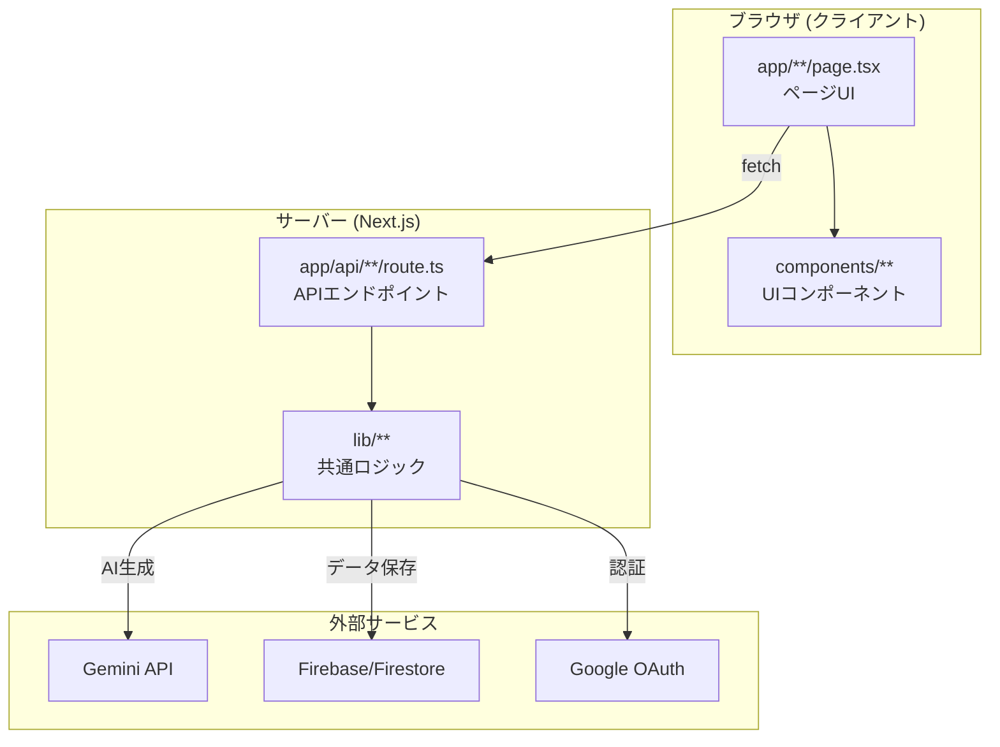
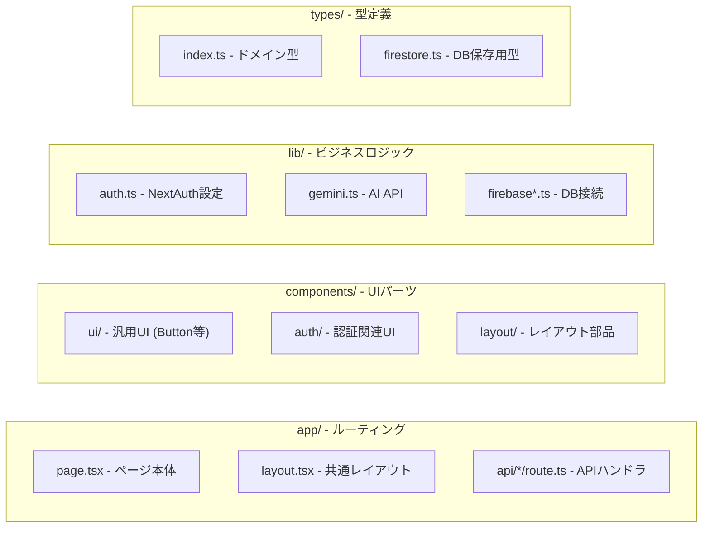
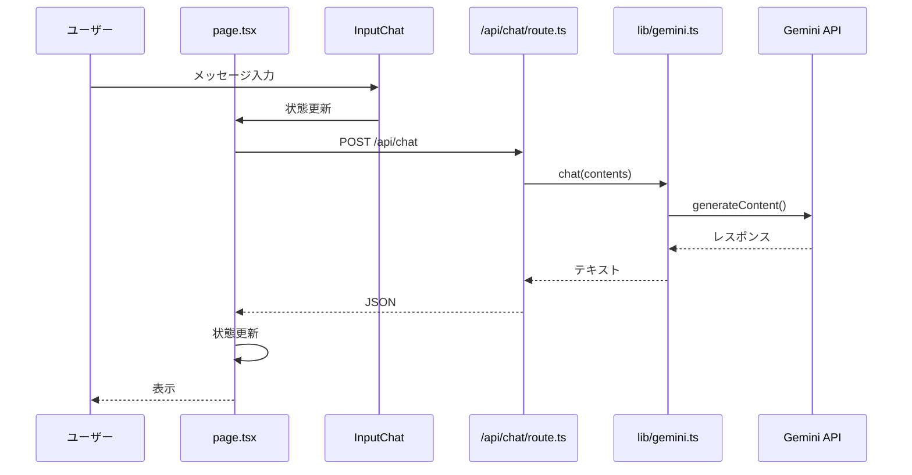
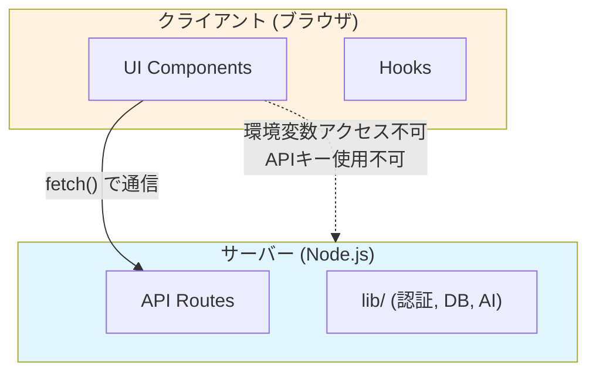

# ディレクトリ構成とアーキテクチャ

## 全体構成図

## ディレクトリ役割

## チャット機能のデータフロー

## ディレクトリ詳細

| ディレクトリ | 役割 | 実行環境 |
|-------------|------|----------|
| `app/` | ルーティングとページ定義 | サーバー/クライアント |
| `app/api/` | RESTful APIエンドポイント | サーバーのみ |
| `components/ui/` | shadcn/ui ベースの汎用コンポーネント | クライアント |
| `components/auth/` | 認証ボタン等 | クライアント |
| `components/layout/` | ページレイアウト部品 | クライアント |
| `lib/` | サーバーサイドロジック | サーバーのみ |
| `types/` | TypeScript型定義 | 両方 |
| `hooks/` | カスタムReactフック | クライアント |

## 重要な境界

- **クライアント**: `NEXT_PUBLIC_*` の環境変数のみアクセス可
- **サーバー**: 全ての環境変数にアクセス可（APIキー等）
